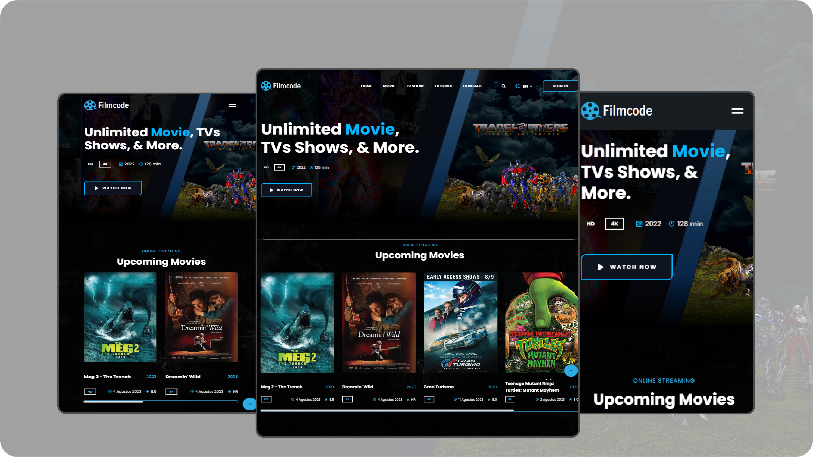

<div align="center">
   
  <br/>
  <br/>

  <h2 align="center">Filmcode - Responsive Website</h2>
  
  This is a Filmcode responsive website, <br/>Responsive for all devices, built using HTML, CSS, and JavaScript.

  <a href="https://adityacahyo4552.github.io/filmcode/"><strong>~ Live Demo ~</strong></a>
</div>

<br />

### Demo Screenshot



### Prerequisites

Before you begin, ensure you have met the following requirements:

- [Git](https://git-scm.com/downloads "Download Git") must be installed on your operating system.

### Run Locally

To run **Filmcode** locally, run this command on your git bash:

Linux and macOS:

```bash
sudo git clone https://github.com/Adityacahyo4552/filmcode.git
```

Windows:

```bash
git clone https://github.com/Adityacahyo4552/filmcode.git
```
